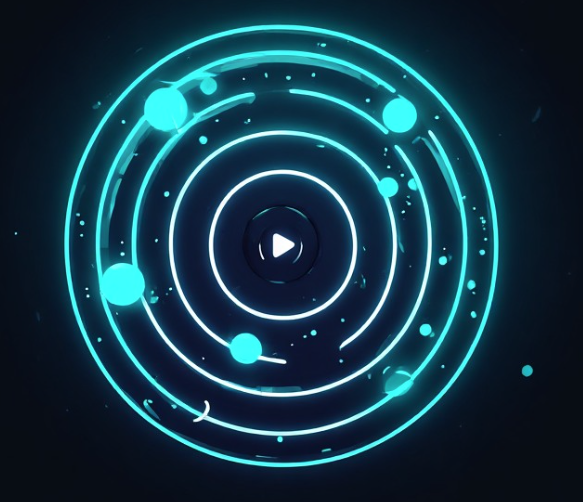

# 16D Quantum Audio Processor (Chrome Extension Manifest V3)

A professional 16D spatial audio processor implemented as a Google Chrome Extension using the modern **Manifest V3** and **Offscreen Document API**. It captures live audio from any Chrome tab (like YouTube or VK) and transforms it into an immersive, multi-dimensional 3D/8D/16D soundscape using physical inertia and psychoacoustic panning.

## 🪐 Key Features

* **Sub-Proximity Stage Control**: Adjust the sound field radius from **0.1 meters** (intimate headphone whisper) up to 15 meters deep field.

* **Ultra-Precise Inertia Timing**: Cycle period adjustable by **0.1-second increments** for perfect rhythm synchronization.
* **Non-Linear Physics Engine**: Sound doesn't just rotate; it mimics gravity and inertia with phase shifts, organic Doppler effects, and dynamic "hang/rush" orbital patterns.
* **Binaural Cross-Echo Room Simulation**: Implements asymmetrical cross-channel delays for Arena, Rock Concert, and Ambient Space acoustics.
* **Frequency Separation**: Bass sub-frequencies (below 130-350Hz depending on genre) stay firmly locked in the center to maintain track punch, while vocals and instruments float along the 16D figure-eight hyper-lemniscate path.
* **Persistent Background Processing**: Audio processing continues seamlessly even after closing the popup UI, thanks to strict synchronization between the Popup Controller and the hidden Offscreen Document Core.

## 🛠️ Tech Stack

* **JavaScript (ES6+)**
* **Web Audio API** (`PannerNode` with high-fidelity `HRTF` modeling, `BiquadFilterNode`, `DelayNode`, `GainNode`)
* **Chrome Extensions API** (`tabCapture`, `offscreen`, `storage`)
* **HTML5 Canvas** (Dynamic neon pulse radar visualization mapped to real-time spatial coordinates)

## 🚀 Installation Guide (Developer Mode)

1. **Download or Clone** this repository to your local machine.
2. Open Google Chrome and navigate to `chrome://extensions/`.
3. Enable **Developer mode** using the toggle switch in the top-right corner.
4. Click the **Load unpacked** button in the top-left corner.
5. Select the folder containing the project files.
6. Open a fresh tab with music (e.g., YouTube), open the extension via the icon or `Ctrl+Shift+1`, and click **START**!

## ⌨️ Global Hotkeys

* `Ctrl+Shift+1` — Open/Focus Extension Popup UI
* `Ctrl+Shift+2` — Toggle Panning Geometry (8D Ellipse <-> 16D Hyper-Lemniscate)
* `Ctrl+Shift+3` — Toggle Spatial Pause (Freezes audio particles in their current 3D coordinates)

## 📜 License

MIT License. Free to use, modify, and explore. Created as an experiment in advanced browser-based DSP architecture.
